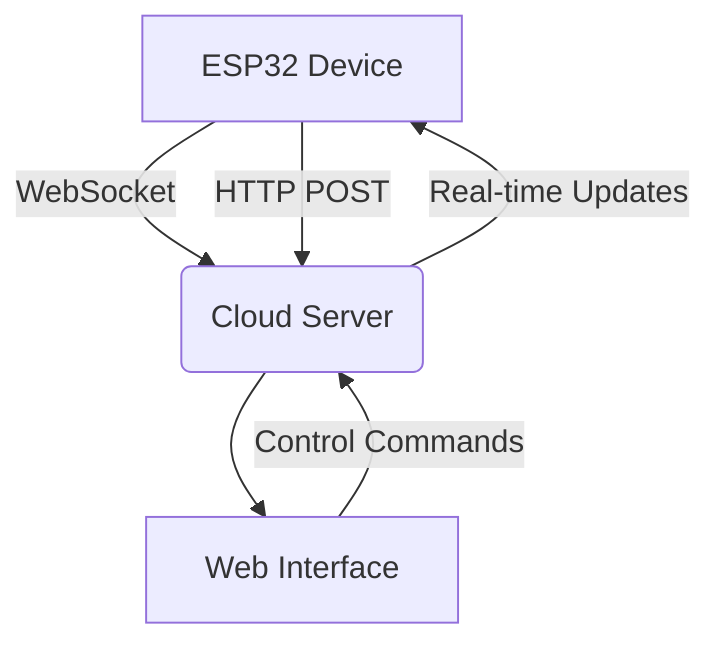

# IoT-Based Smart Lock and Environmental Monitoring System

A comprehensive IoT solution combining secure access control with real-time environmental monitoring. Built on ESP32 microcontrollers, this system enables remote lock management while tracking temperature, humidity, air quality, and security status through multiple sensor inputs.

## 🌟 Key Features

### Smart Lock System
- **Remote Lock Control**: Secure WebSocket commands for lock mechanism
- **Door Status Monitoring**: Real-time door position tracking (open/closed)
- **Multi-Device Support**: Actuator control for pumps and motors
- **Instant Alerts**: Door status change notifications

### Environmental Monitoring
- **Climate Tracking**: DHT22 sensor for temperature & humidity
- **Air Quality Analysis**: Particulate matter concentration measurement
- **Sound Detection**: Acoustic event monitoring
- **Security Sensors**: Motion detection capabilities

## 🛠 Hardware Components

| Component                | Function                               |
|--------------------------|----------------------------------------|
| ESP32 Microcontroller   | Main processing unit                  |
| Electromagnetic Lock    | Door locking mechanism                |
| DHT22 Sensor           | Temperature & humidity monitoring     |
| GP2Y1010AU0F Sensor    | Air particulate detection             |
| Sound Detection Module  | Ambient noise monitoring             |
| PIR Sensor             | Motion detection                      |
| Limit Switch           | Door position sensing                 |
| Relay Modules          | Actuator control (pump/motor)         |

## 🚀 Setup Guide

### Prerequisites
- Arduino IDE with ESP32 support
- WiFi network credentials
- WebSocket server endpoint

### Installation
Clone repository:
```bash
git clone https://github.com/yourusername/smart-lock-iot.git
```

Install required libraries:
```bash
WiFi
WebSockets
ArduinoJSON
DHT sensor library
```

Configure settings in `main.cpp`:
```cpp
const char* ssid = "YOUR_WIFI_SSID";
const char* password = "YOUR_WIFI_PASSWORD";
const char* serverAddress = "YOUR_SERVER_IP";
```
Upload to ESP32 development board.

## 📡 System Architecture


## 🔄 Data Flow
- **Authentication**: Secure token exchange via HTTPS
- **Real-time Control**: WebSocket command processing
- **Sensor Updates**: Periodic environmental data transmission
- **Status Alerts**: Immediate door position notifications

## 💻 Server Requirements
- WebSocket server (Port 4000)
- HTTPS endpoints:
  - `/auth` - Device authentication
  - `/data` - Sensor data collection

## ⚠ Security Features
- Token-based authentication
- Encrypted communication
- Device-specific API keys
- Secure credential storage

## 🌱 Contributing
Contributions welcome! Please follow these steps:
1. Fork the repository
2. Create a feature branch (`git checkout -b feature/improvement`)
3. Commit changes
4. Push to the branch
5. Open a Pull Request

## 📄 License
MIT License - See [LICENSE](LICENSE) for details.
# IoT-Based Smart Lock and Environmental Monitoring System

A comprehensive IoT solution combining secure access control with real-time environmental monitoring. Built on ESP32 microcontrollers, this system enables remote lock management while tracking temperature, humidity, air quality, and security status through multiple sensor inputs.

## 🌟 Key Features

### Smart Lock System
- **Remote Lock Control**: Secure WebSocket commands for lock mechanism
- **Door Status Monitoring**: Real-time door position tracking (open/closed)
- **Multi-Device Support**: Actuator control for pumps and motors
- **Instant Alerts**: Door status change notifications

### Environmental Monitoring
- **Climate Tracking**: DHT22 sensor for temperature & humidity
- **Air Quality Analysis**: Particulate matter concentration measurement
- **Sound Detection**: Acoustic event monitoring
- **Security Sensors**: Motion detection capabilities

## 🛠 Hardware Components

| Component                | Function                               |
|--------------------------|----------------------------------------|
| ESP32 Microcontroller   | Main processing unit                  |
| Electromagnetic Lock    | Door locking mechanism                |
| DHT22 Sensor           | Temperature & humidity monitoring     |
| GP2Y1010AU0F Sensor    | Air particulate detection             |
| Sound Detection Module  | Ambient noise monitoring             |
| PIR Sensor             | Motion detection                      |
| Limit Switch           | Door position sensing                 |
| Relay Modules          | Actuator control (pump/motor)         |

## 🚀 Setup Guide

### Prerequisites
- Arduino IDE with ESP32 support
- WiFi network credentials
- WebSocket server endpoint

### Installation
Clone repository:
```bash
git clone https://github.com/yourusername/smart-lock-iot.git
```

Install required libraries:
```bash
WiFi
WebSockets
ArduinoJSON
DHT sensor library
```

Configure settings in `main.cpp`:
```cpp
const char* ssid = "YOUR_WIFI_SSID";
const char* password = "YOUR_WIFI_PASSWORD";
const char* serverAddress = "YOUR_SERVER_IP";
```
Upload to ESP32 development board.

## 📡 System Architecture


## 🔄 Data Flow
- **Authentication**: Secure token exchange via HTTPS
- **Real-time Control**: WebSocket command processing
- **Sensor Updates**: Periodic environmental data transmission
- **Status Alerts**: Immediate door position notifications

## 💻 Server Requirements
- WebSocket server (Port 4000)
- HTTPS endpoints:
  - `/auth` - Device authentication
  - `/data` - Sensor data collection

## ⚠ Security Features
- Token-based authentication
- Encrypted communication
- Device-specific API keys
- Secure credential storage

## 🌱 Contributing
Contributions welcome! Please follow these steps:
1. Fork the repository
2. Create a feature branch (`git checkout -b feature/improvement`)
3. Commit changes
4. Push to the branch
5. Open a Pull Request

## 📄 License
MIT License - See [LICENSE](LICENSE) for details.
# IoT-Based Smart Lock and Environmental Monitoring System

A comprehensive IoT solution combining secure access control with real-time environmental monitoring. Built on ESP32 microcontrollers, this system enables remote lock management while tracking temperature, humidity, air quality, and security status through multiple sensor inputs.

## 🌟 Key Features

### Smart Lock System
- **Remote Lock Control**: Secure WebSocket commands for lock mechanism
- **Door Status Monitoring**: Real-time door position tracking (open/closed)
- **Multi-Device Support**: Actuator control for pumps and motors
- **Instant Alerts**: Door status change notifications

### Environmental Monitoring
- **Climate Tracking**: DHT22 sensor for temperature & humidity
- **Air Quality Analysis**: Particulate matter concentration measurement
- **Sound Detection**: Acoustic event monitoring
- **Security Sensors**: Motion detection capabilities

## 🛠 Hardware Components

| Component                | Function                               |
|--------------------------|----------------------------------------|
| ESP32 Microcontroller   | Main processing unit                  |
| Electromagnetic Lock    | Door locking mechanism                |
| DHT22 Sensor           | Temperature & humidity monitoring     |
| GP2Y1010AU0F Sensor    | Air particulate detection             |
| Sound Detection Module  | Ambient noise monitoring             |
| PIR Sensor             | Motion detection                      |
| Limit Switch           | Door position sensing                 |
| Relay Modules          | Actuator control (pump/motor)         |

## 🚀 Setup Guide

### Prerequisites
- Arduino IDE with ESP32 support
- WiFi network credentials
- WebSocket server endpoint

### Installation
Install required libraries:
```bash
WiFi
WebSockets
ArduinoJSON
DHT sensor library
```

Configure settings in `main.cpp`:
```cpp
const char* ssid = "YOUR_WIFI_SSID";
const char* password = "YOUR_WIFI_PASSWORD";
const char* serverAddress = "YOUR_SERVER_IP";
```
Upload to ESP32 development board.

## 📡 System Architecture


## 🔄 Data Flow
- **Authentication**: Secure token exchange via HTTPS
- **Real-time Control**: WebSocket command processing
- **Sensor Updates**: Periodic environmental data transmission
- **Status Alerts**: Immediate door position notifications

## 💻 Server Requirements
- WebSocket server (Port 4000)
- HTTPS endpoints:
  - `/auth` - Device authentication
  - `/data` - Sensor data collection

## ⚠ Security Features
- Token-based authentication
- Encrypted communication
- Device-specific API keys
- Secure credential storage

## 🌱 Contributing
Contributions welcome! Please follow these steps:
1. Fork the repository
2. Create a feature branch (`git checkout -b feature/improvement`)
3. Commit changes
4. Push to the branch
5. Open a Pull Request

## 📄 License
MIT License - See [LICENSE](LICENSE) for details.
